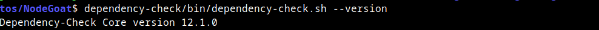
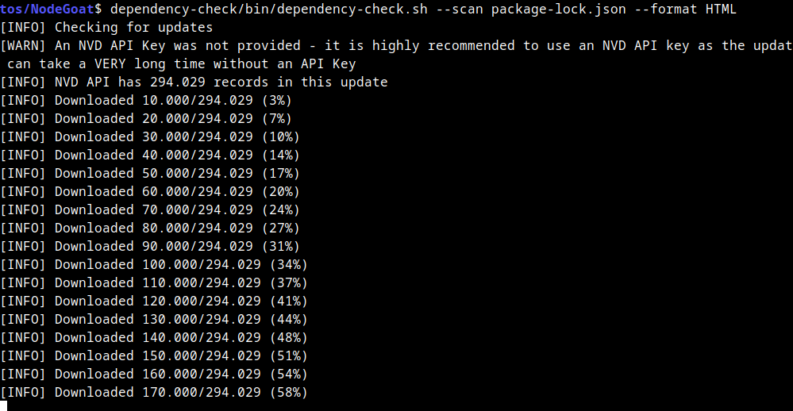

# Actividad 3: Análisis de Dependencias con Dependency-Check

**Tema:** Detección de librerías y paquetes vulnerables  
**Objetivo:** Usar Dependency-Check para analizar dependencias en un proyecto

---

## ¿Qué es Dependency-Check?

[Dependency-Check](https://owasp.org/www-project-dependency-check/) es una herramienta de código abierto de OWASP que permite identificar dependencias vulnerables en un proyecto al compararlas con bases de datos de vulnerabilidades conocidas, como la National Vulnerability Database (NVD).

Su propósito es ayudar a los desarrolladores y equipos de seguridad a detectar y mitigar riesgos asociados con el uso de librerías desactualizadas o inseguras.

---

## Instalar OWASP Dependency-Check

Ejecutar los siguientes comandos en la terminal:

```bash
wget https://github.com/jeremylong/DependencyCheck/releases/download/v12.1.0/dependency-check-12.1.0-release.zip

unzip dependency-check-12.1.0-release.zip
```

Para confirmar que la instalación fue exitosa, ejecuta:

```bash
dependency-check/bin/dependency-check.sh --version
```

Si la instalación es correcta, se debería mostrar la versión de la herramienta en la terminal.



---

## Analizar un proyecto en Node.js

Para verificar vulnerabilidades en las dependencias de un proyecto basado en Node.js, crea el archivo `package-lock.json` de ejemplo con dependencias vulnerables:

Puedes [descargarlo desde aqui.](files/poackage-lock.json)

archivo `files/package-lock.json`
```json
{
  "name": "example-project",
  "version": "1.0.0",
  "lockfileVersion": 2,
  "requires": true,
  "dependencies": {
    "lodash": {
      "version": "4.17.15",
      "resolved": "https://registry.npmjs.org/lodash/-/lodash-4.17.15.tgz",
      "integrity": "sha512-...==",
      "dev": false
    },
    "express": {
      "version": "4.17.1",
      "resolved": "https://registry.npmjs.org/express/-/express-4.17.1.tgz",
      "integrity": "sha512-...==",
      "dev": false
    },
    "debug": {
      "version": "2.6.9",
      "resolved": "https://registry.npmjs.org/debug/-/debug-2.6.9.tgz",
      "integrity": "sha512-...==",
      "dev": false
    }
  }
}
```

Y ejecutar Dependency-Check:

```bash

dependency-check/bin/dependency-check.sh --scan package-lock.json --format HTML
```
Cuando se ejecuta se descargan los registros de la NVD (National Vulnerability Database). Como son muchos, tarda un rato, o sea que paciencia¡¡¡



Ejemplo de vulnerabilidad detectada:

> **High severity:** `lodash@4.17.15` - Prototype Pollution vulnerability

Después del análisis, Dependency-Check generará un informe en formato HTML con detalles sobre las vulnerabilidades encontradas.


---

## Mitigación y Mejores Prácticas

- Para reducir los riesgos de seguridad en el proyecto, actualizar dependencias vulnerables con la última versión disponible.  
  Se pueden usar herramientas integradas como:

  - **Node.js:** `npm audit fix`  
  - **Python (pip):** `pip list --outdated`

Mantener las dependencias actualizadas es clave para prevenir ataques basados en vulnerabilidades conocidas.
